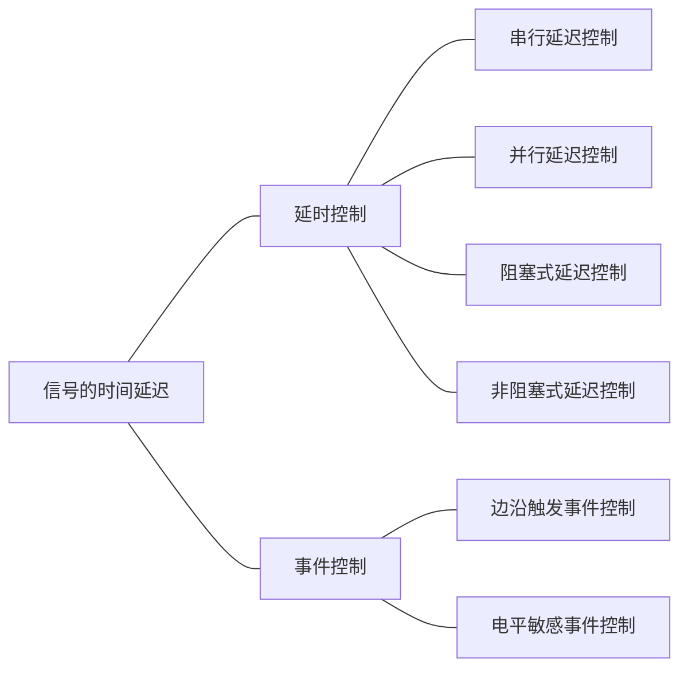

# 仿真验证与Testbench编写

## 概述

仿真，也叫模拟，是通过使用EDA仿真工具，通过输入信号，比对输出信号（波形、文本或VCD（Value Change Dump）文件）和期望值，来确定是否得到与期望所一致的正确的设计结构，验证设计的正确性。

### 流程

1. 功能验证
2. 综合验证
3. 时序验证
4. 板级验证

## Testbench及其结构

在仿真时Testbench用来产生激励给待验证设计DUV（Design Under Verification），或者称为待测设计DUT（Design Under Test）

### T触发器测试程序示例

```verilog
module Tflipflop_tb;
    reg clk, rst_n, T;
    wire data_out;
    TFF U1(.data_out(data_out), .T(T), .clk(clk), .rst_n(rst_n))
    always
        #5 clk = ~clk;
    initial
        begin
            clk = 0;
            #3 rst_n = 0;
            #5 rst_n = 1;
            T = 1;
            #30 T = 0;
            #20 T = 1;
        end
    
    initial
        begin
            $monitor($time, "T=%b, clk=%b, rst_n=%b, data_out=%b", T, clk, rst_n, data_out);
        end
endmodule
```

### Testbench主要功能

1. 为DUT提供激励信号
2. 正确实例化DUT
3. 将仿真数据显示在终端或存为文件，也可以显示在波形窗口以供分析检查
4. 复杂设计可以使用EDA工具，或者通过用户接口自动比较仿真结果与理想值，实现结果的自动检查。

### 注意

1. Testbench代码不需要可综合，Testbench代码只是硬件描述行为不是硬件设计。
2. 行为级描述效率高。
3. 掌握结构化、程式化的描述方式。结构化的描述有利于设计维护，可通过initial、always和assign语句将不同的测试激励划分开来。一般不要将所有的测试都放在一个语句块中。

### 仿真结果确认

1. 直接观察波形
2. 打印文本法
   -  $display，直接输出到标准输出设备
   -  $monitor，监控参数的变化
   -  $fdisplay，输出到文件
3. 自动检查仿真结果
4. 使用VCD文件

### 仿真效率

Verilog HDL行为级仿真代码的执行时间比较长，主要原因是通过串行软件代码完成并行语义的转化。

1. 减小层次结构
2. 减少门级代码的使用
3. 仿真精度越高，效率越低
4. 进程越少，效率越高
5. 减少仿真器的输出显示

## 与仿真相关的系统任务

### \$display 和 \$write

`$display("<format_specifiers>", <signal, signal2, ..., signaln>);`

`$write("<format_specifiers>", <signal, signal2, ..., signaln>);`

"<format_specifiers>"：格式控制

<signal, signal2, ..., signaln>：信号输出列表

\$display 将待定信息输出到标准输出设备后换行

\$write 输出特定信息后不换行

输出格式说明由"%"和格式字符组成，其作用是将输出的数据转换成指定的格式输出

### \$monitor 和 \$strobe

1. \$monitor 的语法格式：

`$monitor("<format_specifiers>", <signal, signal2, ... , signaln>);`

\$monitor 提供了监控和输出参数列表中的表达式或变量值的功能，输出控制和输出列表规则与 \$display 相同。

\$monitor 建立了一个处理机制，每当参数列表中变量或表达式的值发生变化时，整个参数列表中变量或表达式的值都将输出显示。

\$monitoron 和 \$monitoroff 任务的作用是通过打开和关闭监控标志来控制任务 \$monitor 的启动和停止。

通常在通过调用 \$monitoron 启动 \$monitor 时，不管 \$monitor 参数列表中的值如何变化，总是立刻输出显示当前时刻参数列表中的值。

2. \$strobe 的语法格式：

`$strobe(<functions_or_signals>);`

`$strobe("<string_and/or_variables>", <functions_or_signals>);`

\$strobe 系统任务用于某时刻所有时间处理完后，在时间步的结尾输出一行格式化的文本。

\$strobe：十进制

\$strobeb：二进制

\$strobeo：八进制

\$strobeh：十六进制

\$strobe 任务在被调用时刻所有的赋值语句都完成后，才输出相应的文字信息。

### \$time 和 \$realtime

``timescale 1ns/1ns` 时钟、采样

系统函数 \$time 返回一个 64bit 整数表示当前的仿真时刻值，以模块开始仿真的时间为基准

\$realtime 返回一个实型数，很少用

### \$finish 和 \$stop

语法格式：

`$finish;`

`$finish(n);`

`$stop;`

`$stop(n);`

| n 的取值 |                         含义                         |
| :------: | :--------------------------------------------------: |
|    0     |                    不输出任何信息                    |
|    1     |                  给出仿真时间和位置                  |
|    2     | 给出仿真时间和位置，还有所用 memory 及 CPU时间的统计 |

\$finish 的作用是退出仿真器，结束仿真。默认参数值为 1。

\$stop 的作用是把EDA工具置于暂停模式，在仿真环境下给出一个交互式的命令提示符，将控制权交给用户。

### \$readmemh 和 \$readmemb

\$readmem 和 \$readmemb 用来从文件中读取数据到存储器中，可在仿真的任何时刻被执行调用

语法格式：

`$readmemb("<file_name>", <memory_name>);`

`$readmemb("<file_name>", <memory_name>, <start_addr>);`

`$readmemb("<file_name>", <memory_name>, <start_addr>, <finish_addr>);`

\$readmenh 同理

### \$random

\$random 是产生随机数的系统函数，每次调用将返回一个32位的带符号整型随机数。

语法格式：

`$random%<number>`

给出一个范围在`(-b+1, b-1)`之间的随机数

## 信号时间赋值语句



### 时间延迟的语法说明

语法格式：

`#<延迟时间> 行为语句;`

`#<延迟时间>`

#### 时间控制方式

1. 外部时间控制方式：时间控制出现在整个过程赋值语句的最左端

`#5 a = b;`

仿真时相当于：

```verilog
initial
    begin
        #5; 
        a = b;
    end
```

2. 内部时间控制方式：过程赋值语句中的时间控制部分出现在赋值操作符和赋值表达式之间的时间控制方式

`a = #5 b;`

执行时相当于：

```verilog
initial
    begin
        temp = b;
        #5;
        a = temp;
    end
```

### 时间延迟的描述形式

#### 串行延迟控制

begin-end 过程块加上延迟赋值语句

若在延迟时间后有相应的行为语句，仿真进行到这条语句后，会等到延迟时间量过去后再执行行为语句。

```verilog
`timescale 1ns/1ns
module serial_delay(q0_out, q1_out);
    output q0_out, q1_out;
    reg q0_out, q1_out;
    initial
        begin
            q0_out = 1'b0;
            #50 q0_out = 1'b1;
            #100 q0_out = 1'b0;
            ...
        end
    
    initial
        begin
            q1_out = 1'b0;
            #100 q1_out = 1'b1;
            #100 q1_out = 1'b0;
        end
endmodule
```

#### 并行延迟控制

fork-join 过程块加上延迟赋值语句

并行延迟控制方式中的多条延迟控制语句是并行执行的

```verilog
`timescale 1ns/1ns
module serial_delay(q0_out, q1_out);
    output q0_out, q1_out;
    reg q0_out, q1_out;
    initial
        fork
            q0_out = 1'b0;
            #50 q0_out = 1'b1;
            #100 q0_out = 1'b0;
            ...
        join
    
    initial
        fork
            q1_out = 1'b0;
            #100 q1_out = 1'b1;
            #100 q1_out = 1'b0;
        join
endmodule
```

#### 阻塞式延迟控制

在阻塞式过程赋值基础上带有延迟控制的情况

各条语句依次执行，上一条语句赋值操作没有完成之前下一条语句不会开始执行

```verilog
initial
    begin
        a = 0;
        a = #5 1;
        a = #10 0;
        ...
    end
```

#### 非阻塞式延迟控制

在非阻塞式过程赋值基础上带有延迟控制的情况

各条非阻塞式赋值语句均以并行方式执行

```verilog
initial
    begin
        a <= 0;
        a <= #5 1;
        a <= #10 0;
        ...
    end
```

### 边沿触发事件控制

边沿事件控制方式是在指定的信号变化时刻，即指定的信号跳变沿才触发语句的执行。

语法格式：

`@(<事件表达式>) 行为语句;`

`@(<事件表达式>);`

`@(<事件表达式1> or <事件表达式2> or ... or <事件表达式n>) 行为语句;`

`@(<事件表达式1> or <事件表达式2> or .. or <事件表达式n>) 行为语句;`

####  事件表达式

1. `<信号名>`
2. `posedge <信号名>`
3. `negedge <信号名>`

信号名可以是任何数据类型的标量或矢量

| 正跳变    | 负跳变 |
| --------- | ------ |
| $0\to x$ | $1\to x$ |
| $0\to z$ | $1\to z$ |
| $0\to1$ | $1\to0$ |
| $x\to1$ | $x\to0$ |
| $z\to1$ | $z\to0$ |

```verilog
//时钟脉冲计数器
module clk_counter(clk, count_out);
    input clk;
    output count_out;
    reg [3:0] count_out;
    initial
        count_out = 0;
    
    always@(posedge clk)
        count_out = count_out + 1;
endmodule
```

```verilog
//测定输入时钟高低电平持续时间
module clk_time_mea(clk);
    input clk;
    time posedge_time, negedge_time;
    time high_last_time, low_last_time, last_time;
    initial
        begin
            @(posedge clk);
            posedge_time = $time;
            @(negedge clk);
            negedge_time = $time;
            @(posedge clk);
            last_time = $time - posedge_time;
            high_last_time = negedge_time - posedge_time;
            low_last_time = last_time - high_last_time;
        end
endmodule
```

### 电平敏感事件控制

语法格式：

`wait(条件表达式) 行为语句;`

`wait(条件表达式);`

条件表达式为真时，执行语句

一般情况下会构成 latch， 但现在又不用这玩意……

```verilog
wait(enable == 1)
begin
    d = a & b;
    d = d | c;
end
```

第 2 种表达式没有包含行为语句，仿真进程执行到 wait 控制语句时，若条件表达式为假，进入等待状态，一直到条件表达式取值为真。

## 任务与函数

### 任务

为了提高设计者的效率

#### 定义

#### 注意

1. 任务名后不能出现输入输出端口列表
2. 任务中可以有延时语句、敏感事件控制语句等事件控制语句
3. 任务可以没有或可以有一个或多个输入、输出和双向端口
4. 任务可以没有返回值
5. 任务可以调用其它的任务和函数

#### 任务的调用

`<任务名>(端口1, 端口2,...)`

使用任务可以使程序更加简洁易懂

### 函数

#### 定义

```verilog
function <> <>;
```

#### 注意

1. 
2. 函数至少必须有一个输入端口
3. 函数不能有任何类型的输出端口和双向端口

#### 函数的调用

